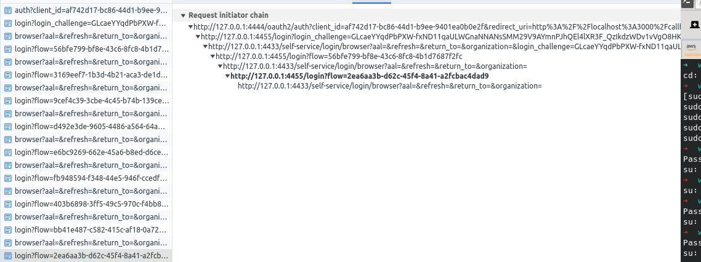

### Run

`./run.sh .env` spins up Hydra, Kratos and self-service standalone UI along with the Consent UI

Copy & Paste the link from here into a browser:

`docker exec -it my-ory cat /logs/client.log`

### Expected result

Exchange of the `login_challenge` and redirect to the login UI page (4455), for authentication and continue the flow. 

### Actual result

Infinite redirects between Kratos BE login/browser and login UI

### Tried

* play between different Kratos/Hydra versions, same issue
* play with Cookies config... didn't make a diff